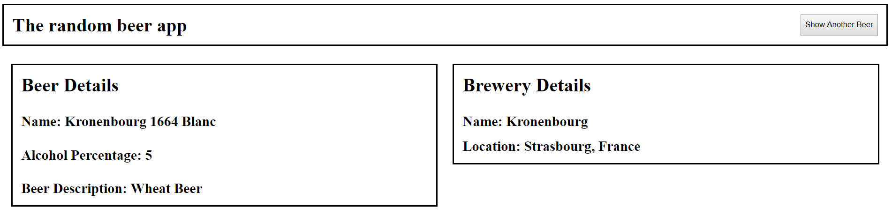

# Random beer application

An application that generates details about a random beer.

## Application interface


## Built With
* [Gradle](https://gradle.org/)
* [Spring Boot](https://spring.io/projects/spring-boot)
    * [Spring Boot Starter Web](https://mvnrepository.com/artifact/org.springframework.boot/spring-boot-starter-web)
    * [Spring Boot Starter Actuators](https://mvnrepository.com/artifact/org.springframework.boot/spring-boot-starter-actuator)
    * [Spring Boot Starter Data](https://mvnrepository.com/artifact/org.springframework.boot/spring-boot-starter-data-jpa)
    * [Spring Boot Starter Data REST](https://mvnrepository.com/artifact/org.springframework.boot/spring-boot-starter-data-rest)
    * [Spring Boot Starter Test](https://mvnrepository.com/artifact/org.springframework.boot/spring-boot-starter-test) (JUNIT 4)
* [NPM](https://www.npmjs.com/)
* [Webpack](https://webpack.js.org/)
* [Babel](https://babeljs.io/)
* [H2](https://mvnrepository.com/artifact/com.h2database/h2)
* [React](https://reactjs.org/)
* [Axios](https://github.com/axios/axios)

## Checking out the repository
```
git clone https://bitbucket.org/iluci92/randombeerapp.git
```

## Running the application using the .jar file
To run the .jar file that comes packed with this repository, run the following command:
```
java -jar build/libs/randomBeerApp-1.0-SNAPSHOT.jar
```

* The application will then be available at: http://localhost:8080/
* The API can be viewed using: http://localhost:8080/api
* The database will get initialized with the scripts in: `src/main/resources/data.sql`
* To view the H2 database, browse: http://localhost:8080/h2-console, and use the following credentials (leave the password empty):
    * JDBC URL: jdbc:h2:~/randomBeerApp;AUTO_SERVER=TRUE
    * User Name: sa

### Running the unit/integration tests
Tests can be run using the gradle wrapper that comes packed with this repository:
```
gradlew test
```

### Assembling a new .jar file
The jar can be build using the gradle wrapper that comes packed with this repository:
```
gradlew assemble
```

### To run webpack in development mode
```
npm install
npm run devServer
```

## Authors
* **[Lucian Gabriel Ilie](mailto:luciangabrielilie@gmail.com)**
